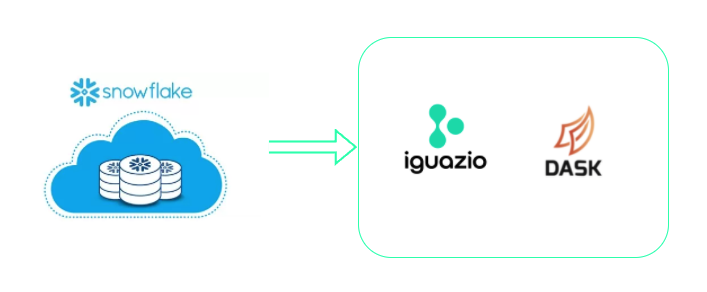
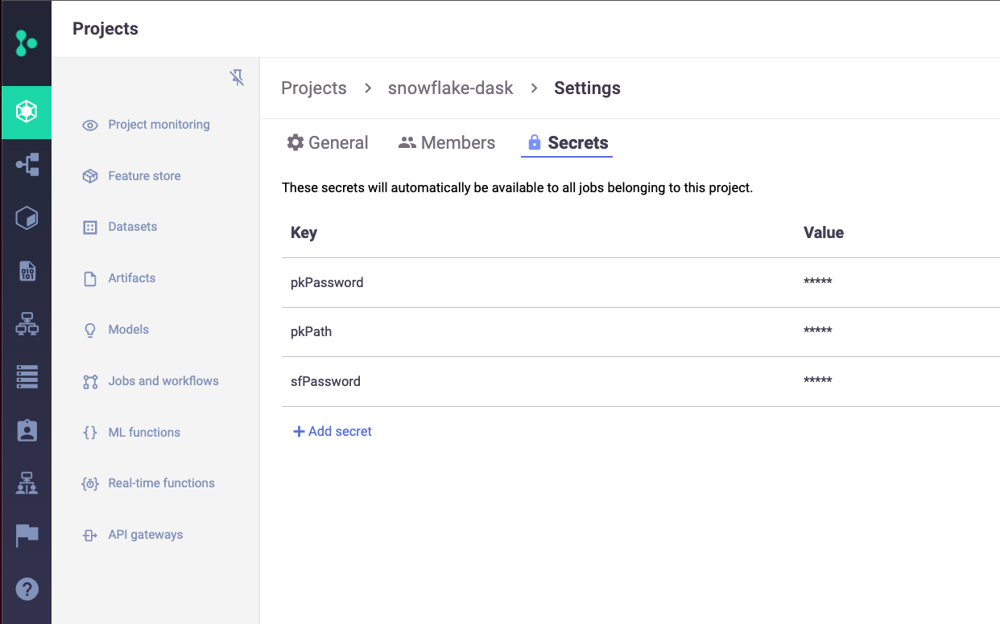

# **Data Preperation Function**

## `Snowflake_dask`



This function query the data from a snowflake database and process the results 
in parallel in a Dask cluster. 
It will publish the dask dataframe in the cluster for other process to use.
It can also write the results dataframe to parquet files.

```markdown

:param context:           the function context
:param dask_client:       dask cluster function name
:param connection_info:   Snowflake database connection info (this will be in a secret later)
:param query:             query to for Snowflake
:param parquet_out_dir:   directory path for the output parquet files (default None, not write out)
:param publish_name:      name of the dask dataframe to publish to the dask cluster (default None, not publish)
```

To use the function, you will need to either have the password or key pair authentication to Snowflake configured. 

To get the password, or generate key pair in Snowflake and configure Snowflake for key pair authentication, please follow Snowflake [documentation](https://docs.snowflake.com/en/user-guide/key-pair-auth.html) here.

After obtained password or key pair, please set up the project secrets in your Iguazio cluster. 

If you are using password, you only need to add ```sfPassword``` secret to the project settings. 

If you are using the key pair authentication, you will need to add both ```pkPath``` and ```pkPassword``` to the project settings.

 where: 
 
 ```pkPath``` is the file path to your private key file in the cluster, for example ```/User/rsa_key.p8``` 
 
```pkPassword``` is your private key encryption password. Please see the screenshot below for your reference.


